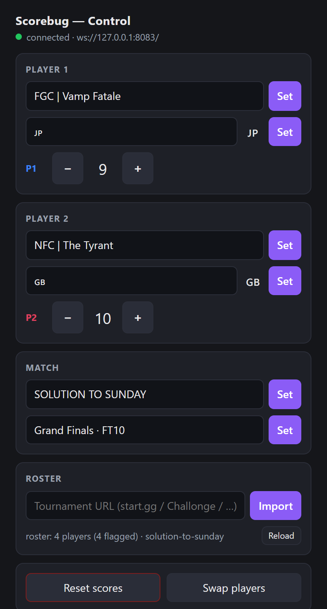

# Tally

**A Streamer.bot-native tournament scorebug** for OBS, Streamlabs Desktop, XSplit — any
streaming app with a browser source. Player names, scores, and nationality flags on
stream — driven from **Twitch chat**, a **Stream Deck**, **hotkeys**, or a small
**browser control panel**. No dedicated server: Streamer.bot serves the overlays and
holds the state.


Type `!sb p1flag japan` in chat and the flag appears. Import a start.gg or Challonge
bracket once and every entrant's name autocompletes in the control panel — with their
flag. Made for FGC / esports streams that run fast matches and don't want to alt-tab.

| | |
|---|---|
| **Overlay** | the bundled **Primetime** theme — an ESPN-style title plate + one combined strip per player (score · flag · name), with auto-fit type and score-bump/name-swap animation |
| **Teams** | 2 by default, up to **4** (`!sb teams 4` — see below); or use a single strip as a plain on-stream **counter** (deaths, attempts, …) |
| **State** | a handful of Streamer.bot global variables (persist across restarts) |
| **Control** | chat commands, Stream Deck, hotkeys, and `tally-shared/control.html` |
| **Roster** | import a bracket (start.gg, Challonge, TourneyBot, Matcherino, RoundOne) → name autocomplete + flag autofill |
| **Needs** | Streamer.bot (tested on 1.0.4) + a streaming app with a browser source (see below). Node.js 18+ only for the roster import and the local no-SB mock — the scorebug itself runs on Streamer.bot alone |

**Works with any streaming software whose browser source is Chromium-based (≥ 80, i.e.
anything from 2020 on):** the panels are plain web pages loaded from
`http://127.0.0.1:7474` that open a WebSocket to Streamer.bot — nothing OBS-specific.
OBS and Streamlabs Desktop use the same CEF browser source; current XSplit Broadcaster
works too (old XSplit builds shipped an ancient engine — update if panels stay blank).
Where this README says "Browser Source", use your app's equivalent (XSplit: *Webpage*).

## Quick start

First, get the code onto the machine that runs Streamer.bot — either

```
git clone https://github.com/FlashGalatine/tally-scorebug.git
```

or click **<> Code → Download ZIP** on the repo page and extract it. The
`<repo>` paths below refer to that folder.

1. **WebSocket Server** — Streamer.bot → *Servers/Clients → WebSocket Server*: enable,
   `127.0.0.1:8080`, authentication **off**. (`8080` is only Tally's default, not a
   requirement — if the port is taken, run SB's WS server anywhere and append
   `?sbport=<port>` to every panel/control-panel URL, e.g. `…/title-309x49.html?sbport=9090`.
   For a non-localhost host, set `window.__SB_WS_URL = 'ws://host:port/'` in a `<script>`
   tag *before* the `panel-core.js` include instead. Auth off *is* a requirement.)
2. **HTTP Server** — *Servers/Clients → HTTP Server*: enable, `127.0.0.1:7474`, add two
   Path → Folder mappings (folders from wherever you cloned this repo):

   | Path | Folder |
   |---|---|
   | `tally-themes` | `<repo>\tally-themes` |
   | `tally-shared` | `<repo>\tally-shared` |

   (The `tally-` prefix keeps these paths from colliding with other Streamer.bot
   add-ons that serve generic `themes`/`shared` folders. **Upgrading from an older
   Tally that used `themes`/`shared`?** Update both mappings and re-point your
   browser-source URLs below — the old `/themes/…` and `/shared/…` URLs will 404.
   Themes ported from StreamScoreboard need their panels' `panel-core.js` src
   repointed too — see [docs/THEMING.md](docs/THEMING.md).)

3. **Two actions** — Actions → new action named **exactly** `Scoreboard Push`; add a
   sub-action *Core → C# → Execute C# Code*; paste [`actions/scoreboard-push.cs`](actions/scoreboard-push.cs);
   **Compile**. Repeat for `Scoreboard Command` with
   [`actions/scoreboard-command.cs`](actions/scoreboard-command.cs). Both compile with **no
   added references**. (The names matter: panels request `Scoreboard Push` on connect, and
   `Scoreboard Command` runs it by name.)
4. **Your streaming app** — add a Browser Source (OBS/Streamlabs) or Webpage source
   (XSplit) per panel, at its native size:

   ```
   http://127.0.0.1:7474/tally-themes/primetime/panels/title-309x49.html            (309×49)
   http://127.0.0.1:7474/tally-themes/primetime/panels/player1-strip-545x63.html    (545×63)
   http://127.0.0.1:7474/tally-themes/primetime/panels/player2-strip-545x63.html    (545×63)
   ```

5. **Drive it.** Create a chat command `!sb` (Commands tab), then — the step that's easy to
   miss — open the `Scoreboard Command` action and **add the command as a Trigger** on it
   (Triggers box → search the command's name). Then, in chat:

   ```
   !sb header SOLUTION TO SUNDAY      !sb p1name FGC | Vamp Fatale
   !sb subheader Grand Finals · FT10  !sb p1flag japan
   !sb p1+                            !sb swap
   ```

A panel added mid-match paints immediately: on connect it asks Streamer.bot to re-broadcast
current state (there is no "blank until the next update").

## Commands

Everything runs through the one parametric `Scoreboard Command` action:

| `command` | `value` | Effect |
|---|---|---|
| `p1+` `p1-` `p2+` `p2-` | — | score ±1 (clamped 0–99) |
| `p1score` `p2score` | number | set a score directly |
| `reset` | — | all scores → 0 |
| `swap` | — | swap players 1 and 2 (name + score + flag) |
| `p1name` `p2name` | text | set a name — `Sponsor \| Player` renders as a sponsor plate |
| `p1flag` `p2flag` | nation | set the nationality flag (see below) |
| `header` `subheader` | text | match title / subtitle |
| `teams` | 2–4 | enable/disable the optional 3rd and 4th slots (see below) |

Every `p1`/`p2` command also exists as `p3`/`p4` (`p3+`, `p4name`, `p3flag`, …) — they
drive the extra slots of teams mode.

There is one optional extra argument: alongside `command=pNname` you may pass **`flag`**,
and that player's name and nation are applied in a single invocation. The control panel
uses it so one **Set** click sends exactly one `DoAction` — Streamer.bot 1.0.4 bleeds the
arguments of two `DoAction`s that reach the same action within a few milliseconds, so a
burst silently loses one of them. Chat and Stream Deck never need it.

For the same reason there is a batched command, **`setmany`**: each sibling argument
present among `p1name`…`p4name`, `p1flag`…`p4flag`, `header`, `subheader` is applied in
one invocation (absent ones untouched; a bad flag warns and skips just that field). The
control panel uses it to flush every edited-but-unset field on any **Set** click — edit
Player 1 *and* Player 2, click Set once, both land. Chat and Stream Deck never need it.

### Three or four teams (optional)

The scorebug is two slots out of the box. For 3- and 4-way formats (crew battles,
free-for-alls, team leagues), send `teams 3` or `teams 4` (chat: `!sb teams 4`; the
control panel has a **Teams** selector). From then on every broadcast includes
`player3`/`player4`, the control panel grows a **Player 3** / **Player 4** card, and the
`p3*`/`p4*` commands (and their dedicated-command variants `!p3+`, `!p4name`, … — add
them as triggers like the others) drive them. Add the extra Primetime strips as sources:

```
http://127.0.0.1:7474/tally-themes/primetime/panels/player3-strip-545x63.html   (545×63, green)
http://127.0.0.1:7474/tally-themes/primetime/panels/player4-strip-545x63.html   (545×63, gold)
```

The P3/P4 strips render blank until teams mode reaches them, so you can leave the
sources in your scene permanently. `teams 2` returns to the classic scorebug without
erasing the extra slots' names/scores (they come back on the next `teams 3`/`4`), and
two-team broadcasts keep the exact original payload shape, so custom themes that only
know `player1`/`player2` are unaffected. `swap` always swaps slots 1↔2 — with more
teams, re-set names directly.

### Not just scores — use it as a counter

Nothing says a slot has to be a player. A strip is just a **name + a number driven from
chat, a Stream Deck, or a hotkey**, which makes it a ready-made on-stream tally for
anything you'd otherwise count on a sticky note:

- **Souls-like death counter** — `!sb p1name Deaths`, hide the P2 strip (or run a
  one-slot layout), and bind `p1+` to a Stream Deck key. `!sb p1score 57` corrects it.
- **Attempt counter** — "Attempts at this jump": `p1+` per try, `reset` on a new
  obstacle, `header`/`subheader` as the challenge title.
- **Running gags** — times the streamer noticed the same background NPC, rage quits,
  "that's the third time today" oddities. With `teams 3`/`4` you can track several
  counters at once (Deaths / Rage quits / Chat was right).

Tips for counter use: scores clamp at 0–99; leave the flag unset and the flag cell
collapses; mod-only counting works by restricting the chat command's permission in
Streamer.bot (or skipping chat triggers entirely and using the deck/control panel).

**Flags & nation aliases.** A nation can be an ISO-3166 code (`jp`, `gb`, `fr`), one of
~260 country names/aliases (`japan`, `uk`, `britain`, `great britain`, `united kingdom`,
`usa`, `america`, `holland`, …), a flag emoji pasted directly (covers 🏴‍☠️ and friends), or
`none`/`clear` to remove. Values resolve to the flag emoji internally and the theme renders
real SVG flags (flag-icons). Unknown nations are rejected with a warning in SB → Logs, so a
typo can't blank the panel. The alias table lives in [`tally-shared/nations.js`](tally-shared/nations.js)
with a mechanical copy in the C# — `npm run verify` diffs the two so they can't drift.

**Chat styles.** Either one dispatch command (`!sb p1+` — a single trigger handles
everything) or a dedicated command per action (`!p1+`, `!p1flag`, …) — create each command
and add each as a trigger on `Scoreboard Command`. The command text must include the `!`
you actually type. Watch **SB → Logs** for `[Scoreboard Command] token='…'` to see what
each message parsed to.

**Stream Deck / hotkeys.** Make a wrapper action per button: *Set Argument* `command` =
`p1+` → *Run Action* `Scoreboard Command`; bind the key to the wrapper (Stream Deck plugin
→ Do Action). Best for the no-typing commands: scores, reset, swap.

## The control panel



Open **`http://127.0.0.1:7474/tally-shared/control.html`** in any browser tab — or, in OBS,
add it as a **Custom Browser Dock** (View → Docks → Custom Browser Docks). Name fields with roster
autocomplete, flag fields with alias resolution + live preview, score buttons,
titles, reset/swap, and a **Teams** selector (the Player 3/4 cards appear when you
pick 3 or 4). It drives the same `Scoreboard Command` over SB's WebSocket and
live-reflects state, so it never fights chat or the deck. Edited-but-unset fields are
protected from that live reflection, and **any Set click applies every edited field at
once** (one batched `setmany` message) — so you can type both players' names and click a
single Set.

**Roster import (names + flags).** Paste a tournament URL in the Roster card and click
**Import**: every entrant autocompletes, and picking a player auto-fills their flag (from
their start.gg profile location — editable before you Set; that's the override). Setting a
name sends the flag with it *in the same message*, so one click applies both.

The Import button talks to a tiny local helper (it does the scraping — needed only at
import time, never mid-match). Start it any of three ways, no terminal required:

- **From Streamer.bot (automatic):** third action `Roster Helper` with
  [`actions/streamerbot-roster-helper.cs`](actions/streamerbot-roster-helper.cs) — edit
  `BUNDLE`, add **`System.dll`** in the C# editor's **References** tab (required — see the
  file header), Compile, and give it your SB's application-started trigger.
- **Double-click** [`start-roster-helper.bat`](start-roster-helper.bat).
- **Terminal:** `npm run roster` (alias for `node roster-helper.mjs`).

API keys are optional — public Challonge brackets and start.gg's public path work keyless
(a live start.gg test returned 12/12 entrants *with* flags). If a bracket imports flagless,
copy `config.example.json` → `config.json` and set `startggApiKey`. CLI alternative:
`npm run import -- <tournament-url>`.

## Make it yours

The Primetime theme is one look — the wire format is deliberately tiny and any HTML page
can be a panel. **[docs/THEMING.md](docs/THEMING.md)** is a full tutorial with two worked
approaches: a **single-file scorebug** (fewest OBS sources — one combined strip per player,
or one full-scene overlay) and **per-field components** (one small panel per name/score/
flag, maximum layout freedom in OBS), plus the copy-paste flag renderer and the dev loop.

## Try it without Streamer.bot

```
npm install
npm start          # mock Streamer.bot: http://127.0.0.1:7474/ lists the panels
npm run verify     # protocol + HTTP + nation-table parity  → ALL GREEN
```

`npm start` runs a small mock of SB's two servers so you can develop themes and poke the
panels with zero setup: drive state with the console keys (`q/a` P1 ±, `w/s` P2 ±, `r`
reset, `x` swap) or `GET /mock/cmd?command=p1+`. `npm run verify:render` (needs
`npm i --no-save playwright-core`) renders the real theme headless and checks pixels;
`npm run shots` regenerates the screenshots above.

## Troubleshooting

- **Chat command does nothing** → the command isn't a **trigger** on `Scoreboard Command`
  (the action shows Triggers: 0), or its text doesn't match what you type (`p1+` configured
  vs `!p1+` typed). SB → Logs shows `[Scoreboard Command] token='…'` for every hit.
- **Panels blank** → state never arrived over the WS. Check the WS Server is on `:8080`
  with auth off (or that every panel URL carries a matching `?sbport=`, if you moved it),
  and that the action is named exactly `Scoreboard Push` and **compiles**
  (`DoAction` returning ok only means the action *started* — a compile error broadcasts
  nothing). On error the actions broadcast `{ type:'scoreboard:error', message }`.
- **`Uri`/`Process`/`Newtonsoft` "does not exist" when writing your own actions** → SB
  (a .NET Framework 4.7.2 app) resolves a minimal default reference set. Add `System.dll`
  (or SB's own `Newtonsoft.Json.dll`) in the C# editor's **References** tab. Tally's two
  scoreboard actions need no references on purpose.
- **Control panel: clicking Set on a name snaps the box back to the old name** (while the
  same edit works from chat) → you're on an older `control.html` + `Scoreboard Command`
  pair. It sent the name and the flag as two back-to-back `DoAction`s, and SB 1.0.4 bleeds
  the arguments of same-action calls that land within a few milliseconds together: both ran
  as `p<N>flag`, the name was never written, and the next broadcast reflected the old name
  back into the input. SB → Logs shows the tell — two `token='p1flag'` lines and no
  `token='p1name'`. Fix: update `tally-shared/control.html` **and** re-paste
  [`actions/scoreboard-command.cs`](actions/scoreboard-command.cs); together they now send
  name + flag in one call. Updating only the panel still fixes the name (the flag just
  stops riding along until the C# is re-pasted).
- **Import fails with "helper not running"** → start the roster helper (see above).
- **Flags show as letters (GB) in the control panel** → Windows has no color flag-emoji
  glyphs; cosmetic and panel-only. The theme renders real SVG flags.
- **`npm start` fails with `EADDRINUSE`/`EACCES`** → real Streamer.bot already owns
  `:7474`/`:8080`. You don't need the mock when SB is serving; or relocate it:
  `SB_HTTP_PORT=7480 SB_WS_PORT=8090 npm start`.
- **SB says "Unable to start websocket server" on `:8080`, but Task Manager shows no
  culprit** → a zombie socket. If SB previously exited uncleanly (crash/force-kill) while
  the Roster Helper action's `node roster-helper.mjs` child was running, an older version
  of that action let node inherit SB's listen sockets, keeping `:8080` bound under a PID
  that no longer exists. Fix: kill the orphaned node (`taskkill /im node.exe /f`, or find
  it via `Get-NetTCPConnection -LocalPort 8080`), restart SB's WS server, and re-paste the
  current [`actions/streamerbot-roster-helper.cs`](actions/streamerbot-roster-helper.cs) —
  it now launches node with `UseShellExecute = true`, which doesn't pass SB's handles to
  the child, so this can't recur.
- **Subscribe case gotcha (for integrators):** the shim subscribes with lowercase
  `events: { general: ['Custom'] }` even though delivered events carry `General.Custom` —
  capital `General` in the Subscribe silently receives nothing.

## Author & support

Built by **Ashe "Flash" Galatine**.

- Email — [AsheJunius@gmail.com](mailto:AsheJunius@gmail.com)
- X — [@AsheJunius](https://x.com/AsheJunius) · BlueSky — [@projectgalatine.com](https://bsky.app/profile/projectgalatine.com)
- Twitch — [FlashGalatine](https://www.twitch.tv/FlashGalatine) · Discord — [Project Galatine](https://discord.gg/K6pRfSvu2Q)
- Support — Patreon [ProjectGalatine](https://www.patreon.com/ProjectGalatine) · CashApp [$ProjectGalatine](https://cash.app/$ProjectGalatine)

## Credits & license

MIT — see [LICENSE](LICENSE). The Primetime theme and the roster platform scrapers are
vendored from [StreamScoreboard](https://github.com/FlashGalatine) (same author, MIT) —
if you want a full web dashboard, more themes, and per-player add-in fields, that's the
bigger sibling this project is the Streamer.bot-native distillation of. Flag SVGs by
[flag-icons](https://github.com/lipis/flag-icons) (MIT, via jsDelivr); Quantico typeface
via Google Fonts (OFL). See [THIRD_PARTY_NOTICES.md](THIRD_PARTY_NOTICES.md).
